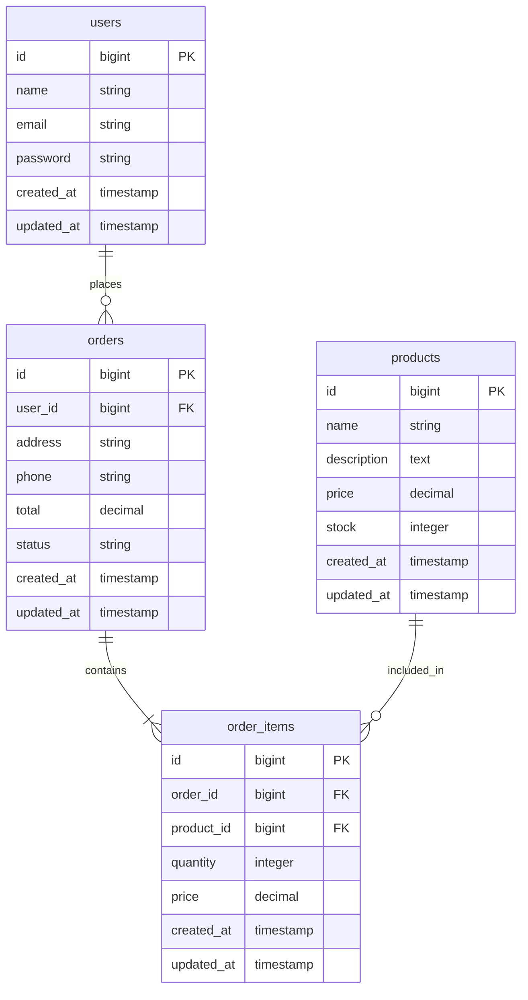

# Mini System - E-Commerce Backend (Laravel + JWT)

A simplified e-commerce backend built with Laravel featuring JWT authentication, products management, and orders processing.

## Features

- **JWT Authentication**: Secure token-based authentication
- **Products Management**: Full CRUD operations with stock tracking
- **Orders Management**: Order creation with stock validation and auto-decrement
- **Stock Logic**: Automatic `out_of_stock` flag when stock reaches 0

## Technologies

- Laravel 11.x
- JWT (php-open-source-saver/jwt-auth)
- SQLite Database
- PHP 8.1+

## Database Schema



## Setup Instructions

### Prerequisites

- PHP >= 8.1
- Composer
- SQLite extension enabled

### Installation

1. **Clone the repository**
   ```bash
   cd mini-system
   ```

2. **Install dependencies**
   ```bash
   composer install
   ```

3. **Environment setup**
   ```bash
   cp .env.example .env
   php artisan key:generate
   php artisan jwt:secret
   ```

4. **Configure database**
   
   The project uses SQLite by default. Ensure your `.env` has:
   ```
   DB_CONNECTION=sqlite
   DB_DATABASE=/absolute/path/to/database.sqlite
   ```

5. **Run migrations**
   ```bash
   php artisan migrate
   ```

6. **Start the server**
   ```bash
   php artisan serve
   ```
   
   The API will be available at `http://127.0.0.1:8000`

## API Endpoints

### Authentication

All endpoints require `Authorization: Bearer {token}` header except `register` and `login`.

| Method | Endpoint | Description | Auth Required |
|--------|----------|-------------|---------------|
| POST | `/api/auth/register` | Register new user | No |
| POST | `/api/auth/login` | Login user | No |
| POST | `/api/auth/logout` | Logout user | Yes |
| GET | `/api/auth/me` | Get authenticated user | Yes |
| POST | `/api/auth/refresh` | Refresh JWT token | Yes |

#### Register
```json
POST /api/auth/register
{
  "name": "John Doe",
  "email": "john@example.com",
  "password": "password123"
}

Response:
{
  "message": "User created successfully",
  "user": { ... },
  "authorization": {
    "token": "eyJ0eXAiOiJKV1...",
    "type": "bearer"
  }
}
```

#### Login
```json
POST /api/auth/login
{
  "email": "john@example.com",
  "password": "password123"
}

Response:
{
  "access_token": "eyJ0eXAiOiJKV1...",
  "token_type": "bearer",
  "expires_in": 3600
}
```

### Products

| Method | Endpoint | Description | Auth Required |
|--------|----------|-------------|---------------|
| GET | `/api/products` | List all products | No |
| GET | `/api/products/{id}` | Get single product | No |
| POST | `/api/products` | Create product | Yes |
| PUT | `/api/products/{id}` | Update product | Yes |
| DELETE | `/api/products/{id}` | Delete product | Yes |

#### Create Product
```json
POST /api/products
{
  "name": "Laptop",
  "description": "High performance laptop",
  "price": 999.99,
  "stock": 10
}

Response:
{
  "id": 1,
  "name": "Laptop",
  "description": "High performance laptop",
  "price": 999.99,
  "stock": 10,
  "out_of_stock": false,
  "created_at": "2025-11-19T21:00:00.000000Z",
  "updated_at": "2025-11-19T21:00:00.000000Z"
}
```

**Note**: The `out_of_stock` attribute is automatically computed (`true` when `stock == 0`).

### Orders

| Method | Endpoint | Description | Auth Required |
|--------|----------|-------------|---------------|
| GET | `/api/orders` | List all orders | Yes |
| GET | `/api/orders/{id}` | Get single order | Yes |
| POST | `/api/orders` | Create order | Yes |

#### Create Order
```json
POST /api/orders
{
  "address": "123 Main St, City",
  "phone": "+1234567890",
  "items": [
    {
      "id": 1,
      "qty": 2
    }
  ]
}

Response:
{
  "message": "Order created successfully",
  "order_id": 1,
  "total": 1999.98,
  "items_count": 1
}
```

**Business Rules**:
- Stock is validated before order creation
- Stock is automatically decremented after successful order
- Transaction rollback if any product is out of stock

## Testing

You can test the API using tools like Postman or curl:

```bash
# Register a user
curl -X POST http://127.0.0.1:8000/api/auth/register \
  -H "Content-Type: application/json" \
  -d '{"name":"Test User","email":"test@test.com","password":"password"}'

# Login
curl -X POST http://127.0.0.1:8000/api/auth/login \
  -H "Content-Type: application/json" \
  -d '{"email":"test@test.com","password":"password"}'

# Create a product (replace TOKEN with your JWT)
curl -X POST http://127.0.0.1:8000/api/products \
  -H "Content-Type: application/json" \
  -H "Authorization: Bearer TOKEN" \
  -d '{"name":"Test Product","description":"Test","price":99.99,"stock":5}'
```

## Project Structure

```
mini-system/
├── app/
│   ├── Http/
│   │   └── Controllers/
│   │       ├── AuthController.php
│   │       ├── ProductController.php
│   │       └── OrderController.php
│   └── Models/
│       ├── User.php
│       ├── Product.php
│       ├── Order.php
│       └── OrderItem.php
├── config/
│   └── auth.php (JWT guard configured)
├── database/
│   └── migrations/
└── routes/
    └── api.php
```

## License

MIT License
