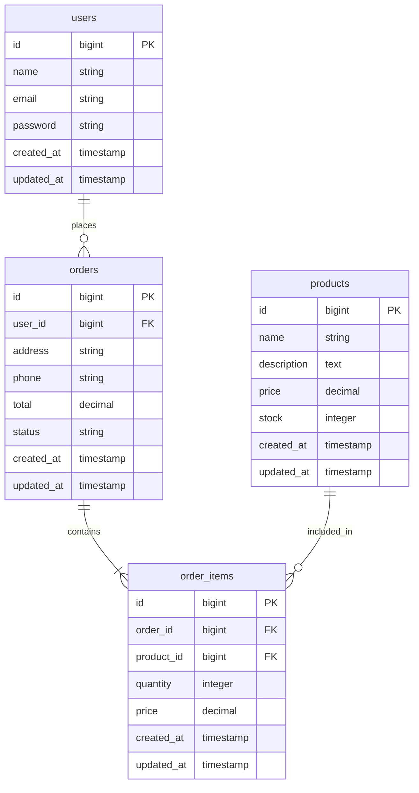

# Mini System Backend

## What is inside?
- Login with token (JWT)
- Products (add, edit, delete)
- Orders (buy things)
- Stock go down when buy

## How to run?
1. `composer install`
2. Copy `.env.example` to `.env`
3. `php artisan key:generate`
4. `php artisan jwt:secret`
5. Make sure database is okay in `.env` (sqlite)
6. `php artisan migrate`
7. `php artisan serve`

Now api is working on `http://127.0.0.1:8000`!

## Database Picture
Here is how database look like:

## Api links
- POST `/api/auth/register` - make new user
- POST `/api/auth/login` - login
- GET `/api/products` - see all products
- POST `/api/orders` - buy something (need token)

